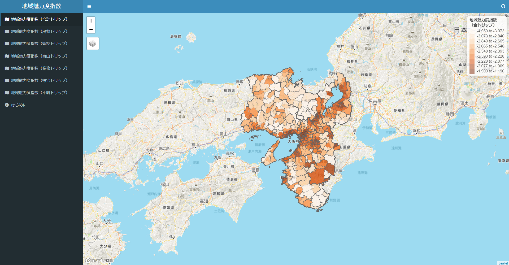

# 地域魅力度指数の開発：近畿パーソントリップ調査による分析

## Shinyウェブアプリケーション

### 地域魅力度指数の可視化

Kondo (2023)において提案した人流データから推定する地域魅力度指数を可視化しています。  
URL: https://keisuke-kondo.shinyapps.io/regional-attractiveness-kansai

### 参考文献
Kondo, K. (2023) "Measuring the Attractiveness of Trip Destinations: A Study of the Kansai Region," RIEB Discussion Paper Series No.2023-07  
URL: https://www.rieb.kobe-u.ac.jp/academic/ra/dp/English/dp2023-07.html

## 利用規約
当サイトで公開している情報（以下「コンテンツ」）は、どなたでも自由に利用できます。コンテンツ利用に当たっては、本利用規約に同意したものとみなします。本利用規約の内容は、必要に応じて事前の予告なしに変更されることがありますので、必ず最新の利用規約の内容をご確認ください。

### 著作権
本コンテンツの著作権は、近藤恵介に帰属します。

### 第三者の権利
本コンテンツは、「パーソントリップ調査」および、「国土数値情報」の情報に基づいて作成しています。本コンテンツを利用する際は、第三者の権利を侵害しないようにしてください。

### 免責事項
<ul>
<li>作成にあたり細心の注意を払っていますが、本サイトの内容の完全性・正確性・有用性等についていかなる保証を行うものでありません。</li>
<li>本サイトを利用したことによるすべての障害・損害・不具合等、作成者および作成者の所属するいかなる団体・組織とも、一切の責任を負いません。</li>
<li>本サイトは、事前の予告なく変更、移転、削除等が行われることがあります。</li>
</ul>

## データ出所

### 第5回近畿圏パーソントリップ調査（京阪神都市圏交通計画協議会）
URL: https://www.kkr.mlit.go.jp/plan/pt/

近畿圏パーソントリップ調査の詳細は上記サイトを参照のこと。

### 国土数値情報（国土交通省）
URL: https://nlftp.mlit.go.jp/ksj/index.html

上記サイトより、「４．交通、パーソントリップ・交通変動量」より、「発生・集中量（ポリゴン）（ライン）」および「OD量（ポリゴン）（ライン）」のデータを取得。

## 作成者
近藤恵介  
独立行政法人経済産業研究所、上席研究員  
神戸大学経済経営研究所、准教授  
Email: kondo-keisuke@rieti.go.jp  
URL: https://keisukekondokk.github.io/  

## 更新履歴

2023年11月10日　誤植修正  
2023年3月31日　GitHub公開  
