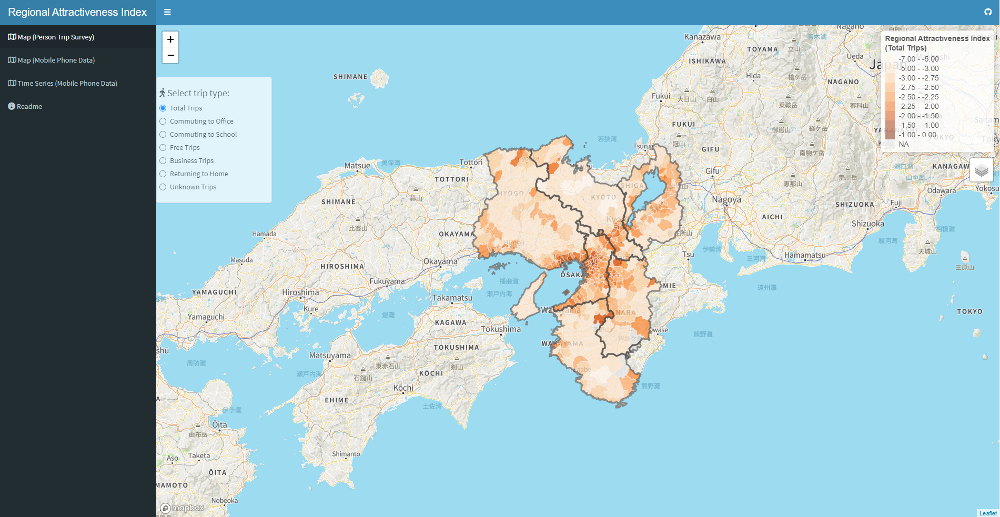

# Measuring the Attractiveness of Trip Destinations: A Study of the Kansai Region of Japan (RIEB DP No. 2023-07)

## Shiny Web App

### Visualizaion

This web app visualizes the regional attractiveness index, estimated from mobility data. The concept is proposed in Kondo (2023).  
URL: https://keisuke-kondo.shinyapps.io/regional-attractiveness-kansai

### Reference
Kondo, K. (2023) "Measuring the Attractiveness of Trip Destinations: A Study of the Kansai Region of Japan," RIEB Discussion Paper Series No.2023-07  
URL: https://www.rieb.kobe-u.ac.jp/academic/ra/dp/English/dp2023-07.html

## Terms of Use
Users (hereinafter referred to as the User or Users depending on context) of the content on this web site (hereinafter referred to as the Content) are required to conform to the terms of use described herein (hereinafter referred to as the Terms of Use). Furthermore, use of the Content constitutes agreement by the User with the Terms of Use. The content of the Terms of Use is subject to change without prior notice.

### Copyright
The copyright of the developed code belongs to Keisuke Kondo.

### Copyright of Third Parties
Keisuke Kondo developed the Content based on the information on the 2010 Person Trip Survey of Kinki Metropolitan Area and the From-To Analysis of the Regional Economy and Society Analyzing System (RESAS). The original data of From-To Analysis is based on Mobile Spatial Statistics® of NTT DOCOMO. The shapefiles were taken from the Digital National Land Information (MLIT of Japan) and the Portal Site of Official Statistics of Japan, e-Stat. Users must confirm the terms of use of the RESAS and the e-Stat, prior to using the Content.

### Disclaimer
<ul>
<li>Keisuke Kondo makes the utmost effort to maintain, but nevertheless does not guarantee, the accuracy, completeness, integrity, usability, and recency of the Content.</li>
<li> Keisuke Kondo and any organization to which Keisuke Kondo belongs hereby disclaim responsibility and liability for any loss or damage that may be incurred by Users as a result of using the Content. Keisuke Kondo and any organization to which Keisuke Kondo belongs are neither responsible nor liable for any loss or damage that a User of the Content may cause to any third party as a result of using the Content</li>
<li>The Content may be modified, moved or deleted without prior notice.</li>
</ul>

## Data Sources

### 2010 Person Trip Survey of Kinki Metropolitan Area (Keihanshin Metropolitan Area Transportation Planning Council)
URL: https://www.kkr.mlit.go.jp/plan/pt/

### Digital National Land Information (MLIT of Japan)
URL: https://nlftp.mlit.go.jp/ksj/index.html

### From-To Analysis: RESAS API
URL: https://opendata.resas-portal.go.jp/docs/api/v1/partner/docomo/destination.html

### Shapefile of Japanese Prefectures and Municipalities (e-Stat, Portal Site of Official Statistics of Japan)
URL: https://www.e-stat.go.jp/

## Author
Keisuke Kondo  
Senior Fellow, Research Institute of Economy, Trade and Industry (RIETI)  
Associate Professor, Research Institute for Economics and Business Administration (RIEB), Kobe University  
Email: kondo-keisuke@rieti.go.jp  
URL: https://keisukekondokk.github.io/  

## Update History

January 1, 2024: English version Uploaded  
November 10, 2023: Typo fixed  
March 31, 2023: Released on GitHub  
